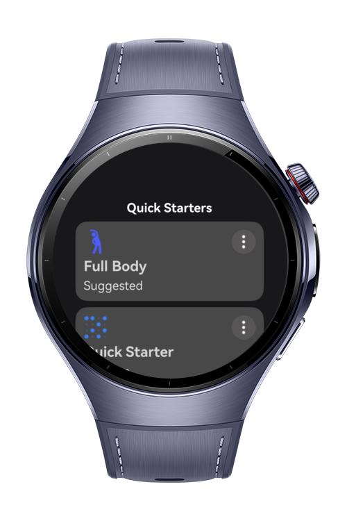
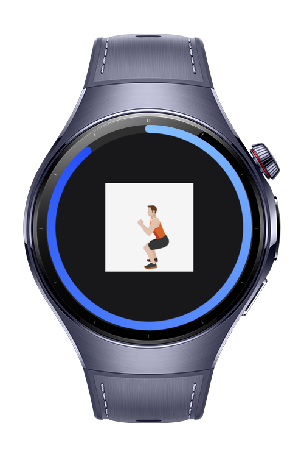
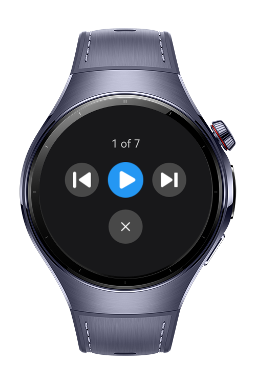

> **Note:** To access all shared projects, get information about environment setup, and view other guides, please visit [Explore-In-HMOS-Wearable Index](https://github.com/Explore-In-HMOS-Wearable/hmos-index).

# Workout App
Getting fit has never been this easy – or this much fun. Want to Get Fit, Lose Weight or Get Strong? Just set your goal, and let our app take care of the rest.

# Preview
<div>




</div>

# Use Cases

- workout animations
- control the workouts

# Tech Stack

- **Languages**: ArkTS
- **Frameworks**: HarmonyOS SDK 5.1.0(18)
- **Tools**: DevEco Studio Vers 5.1.0.842
- **Libraries**: @kit.ArkUI, @ohos/lottie

# Directory Structure

````
├───AppScope
│   └───resources
│       └───base
│           ├───element
│           └───media
├───entry
│   └───src
│       ├───main
│       │   ├───ets
│       │   │   ├───pages 
│       │   │   │   ├───Circuits
│       │   │   │   ├───Complete
│       │   │   │   ├───Index
│       │   │   │   ├───Settings
│       │   │   │   └───Workout
│       │   │   └─── animation
│       │   └───resources
│       │       ├───base
│       │       │   ├───element
│       │       │   ├───media
│       │       │   └───profile
````

# Constraints and Restrictions

## Suported Devices

- Huawei Watch 5

# LICENSE

**Workout App** is distributed under the terms of the MIT License.
See the [LICENSE](/LICENSE) for more information.